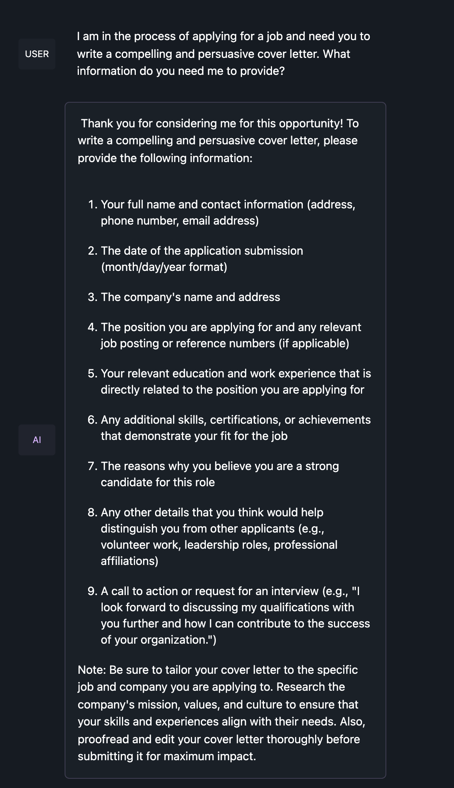

# Lazy-CV: LLM Fueled Cover Letter Generator

**Disclaimer:** I am running this model locally on an M2 Macbook Pro with 96gb of unified memory and do not plan to implement this for web-containers. So your model choice will depend on the hardware you have available and which model you choose to run. 

# Table of contents
1. [Building Initial Prompts (Optional)](#section1)
2. [Setup](#setup)
    1. [Sub paragraph](#subparagraph1)
3. [Output](#output)

## Building An Initial Prompt For Cover Letters (Optional)

Assuming you're running the same model as the repo (Mistral-11B-OmniMix) you shouldn't have to do this process. 

1. Download LMStudio for your platform: https://lmstudio.ai/

  
2. Navigate to the chat tab in the left panel and choose the model you want to generate your cover letters, in my case I am using: https://huggingface.co/TheBloke/Mistral-11B-OmniMix-GGUF
  
3. Next we chat a bit with the model to generate the initial prompt.
    3.1 Question 1: "What information do you need from me to write a compelling cover letter for a job application?"
    

## Setup 

### Setup Section 1 

## Output 
